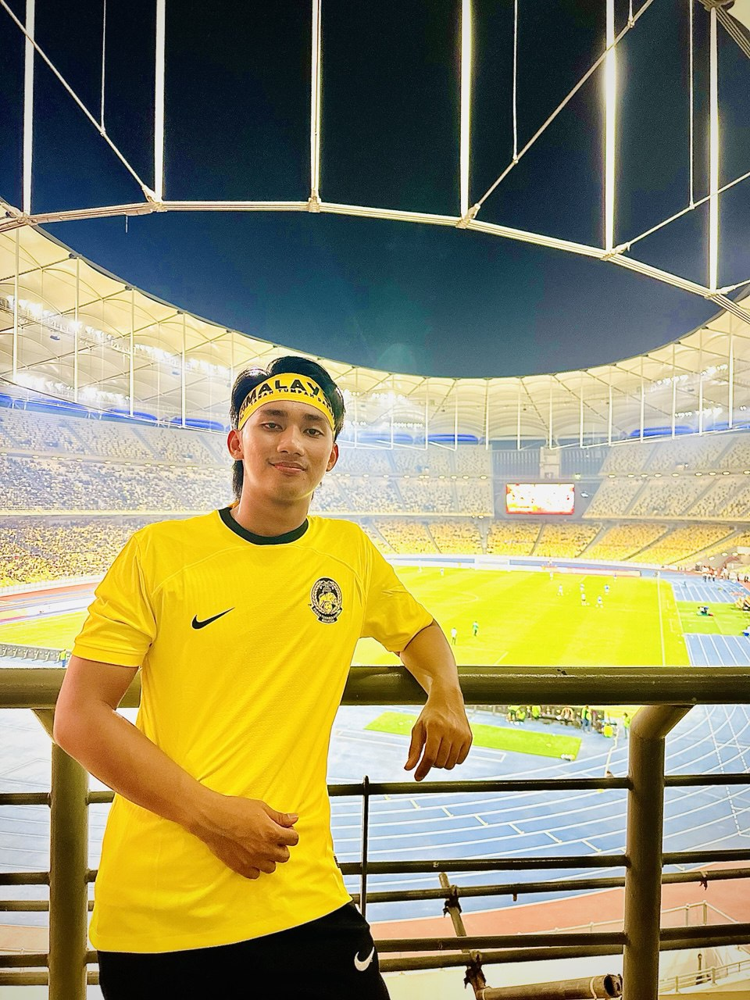

# Introduction
Hi! I'm Ahmad Uzairil Aqil Bin Mohd Nazzri, a student in the Framework-Based Software Design and Development course. 
I [expect to learn a lot about modern software maintenance practices and how to work with legacy systems].

- **Fun fact**: I love playing football every evening.
- **Course expectations**: To develop practical skills in maintaining and evolving real-world software systems..

  <!-- Link to the uploaded image -->

## GitHub Profile

You can view my personalized GitHub profile [[here, insert link to your github profile](https://github.com/uzairilaqil)]

